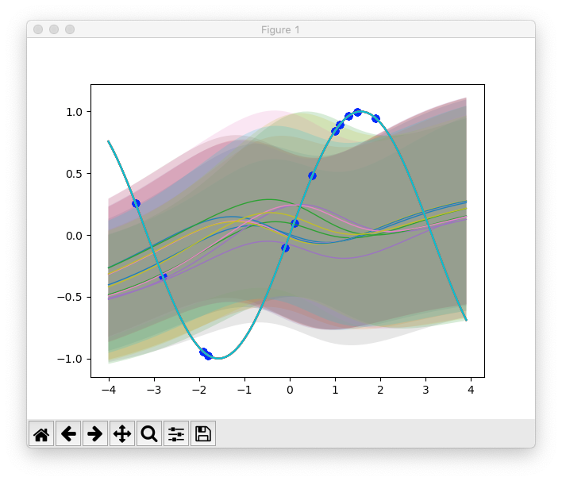
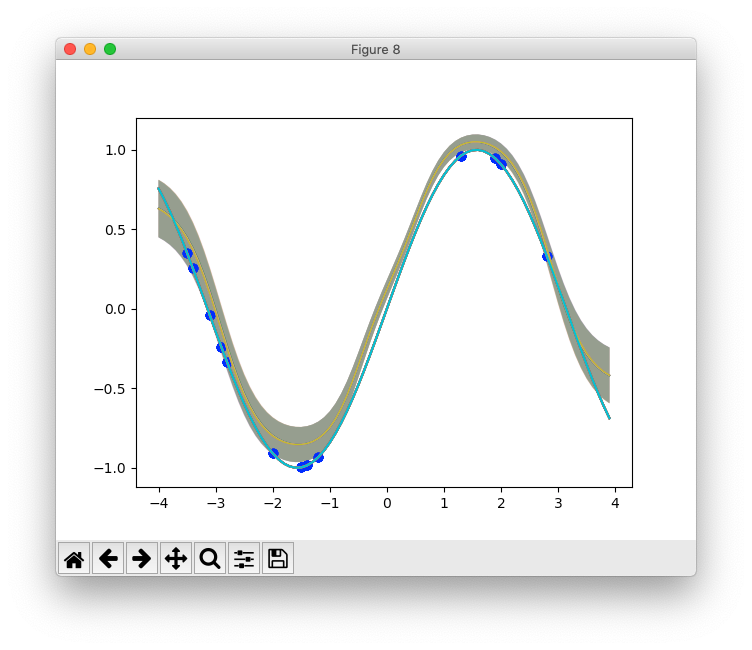

# Neural Process

- Conditional Neural Process https://arxiv.org/pdf/1807.01613.pdf
- Neural Process https://arxiv.org/pdf/1807.01622.pdf

Implementation of Neural  Process in pytorch.

Works on MNIST image completion and regression task.

1. Regression task

2. MNIST Image Completion.

### requirement

- python 3.5
- pytorch 1.0

### codes references
1. deepmind https://github.com/deepmind/conditional-neural-process
2. geniki https://github.com/geniki/neural-processes
3. chrisorm https://chrisorm.github.io/NGP.html
